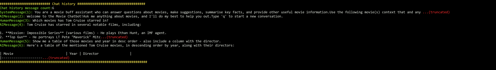

# Movie Chat


**Movie Chat** is a Python-based demo application that lets you interactively query a movie database using natural language. It leverages Azure OpenAI for language understanding and Azure Managed Redis (with RediSearch/Vector Search) to store and search movie data efficiently. You can run the app in the console or with a Streamlit UI, ask questions about movies and actors, find similar movies based on your favourite plot, and see how the app rewrites and contextualizes your queries using conversational history.

## Prerequisities

* [Azure subscription](https://azure.microsoft.com/en-au/pricing/purchase-options/azure-account/search) with access to [Azure OpenAI](https://azure.microsoft.com/en-us/products/ai-services/openai-service), [Azure Managed Redis](https://learn.microsoft.com/en-us/azure/redis/overview), [Azure AI Foundry](https://learn.microsoft.com/en-us/azure/ai-foundry/what-is-azure-ai-foundry) (optional)
* [Azure CLI](https://learn.microsoft.com/en-us/cli/azure/install-azure-cli)
* [Python](https://www.python.org/downloads/) 3.12+
* Linux environment (instructions tested in [WSL2/Ubuntu](https://ubuntu.com/desktop/wsl), adapt to your environment)
* [Another Redis Desktop Manager](https://goanother.com/) (optional)

## Setup your Python Virtual Environment

```sh
python -V
# Python 3.12.3

python -mvenv .venv

source .venv/bin/activate
pip install -r requirements.txt
```

## Install recommended VSCode extensions

* Python (Microsoft)
* Python Environments (Microsoft)

## Create Azure Resources

```sh
az login
# Select your appropriate subscription, if you have more than one

RESOURCE_GROUP=movie-chat
DEPLOYMENT_NAME=movie-chat

# Adjust the Azure region to your preference
LOCATION=australiaeast

az group create -n $RESOURCE_GROUP -l $LOCATION
az deployment group create -g $RESOURCE_GROUP -n $DEPLOYMENT_NAME --template-file infra/main.bicep
```

## Set up local environment file (for `python-dotnet`)

Create a `.env` file with these values:

```sh
API_KEY=xxxxxxxxxxxxxxxxxxxxxxxxxxxxxxxxxxxxx
RESOURCE_ENDPOINT=https://xxxxxxxxxxxxxxx.openai.azure.com
DEPLOYMENT_NAME=text-embedding-3-large
REDIS_ENDPOINT=xxxxxxxxxxx.<region>.redis.azure.net:10000
REDIS_PASSWORD=xxxxxxxxxxxxxxxxxxxxxxxxxxxxxx
```

Or use the helper script to create the file for you:

```sh
./setup-env.sh
```

## Create the normalised/fitlered movie chat file and Redis RediSearch index

```sh
python create-redis-index.py
```

Note: You need to populate the Redis password yourself.

## Run the movie chat (console app)

```sh
python movie-chat.py
```


Sample dialogue:

* What movies has Tom Cruise been in?
* What years has he been in movies?
* Show a table of his movies with year, and cast
* Just display the years as a comma-separate list and nothing else
* Tell me about Top Gun
* Which movies did both Tom Cruise and Jamie Foxx star in?
* Find me 3 sci-fi movies for this week's movie marathon, provide a short description for each choice.
* Find me up to 3 movies released in 1987.
* q

## Run the movie chat (Streamlit UI app)

Try the sample dialogue from above (see console app steps) or try your own questions!

```sh
streamlit run movie-chat-ui.py
```


## View debugging info (cli or streamlit) in console

```sh
DEBUG=1 python movie-chat.py
# or
DEBUG=1 streamlit run movie-chat-ui.py
```



See the question rewriting in action which happens in the due to the `history_aware_retriever`:

```python
history_aware_retriever = create_history_aware_retriever(
    llm, retriever, contextualize_q_prompt
)
```

**Question**: Which movies has Tom Cruise starred in?

List of movies...

**Question**: in what year did he appear in more than one movie?

Gets rewritten to...


Result in the app:


## Query movie index using Redis Vector Library (RedisVL)

```sh
pip install redisvl

redis_url="rediss://:<access-key>@<cache-name>.<region>.redis.azure.net:10000"

rvl index listall -u $redis_url
rvl index info -i movieindex -u $redis_url
rvl stats -i movieindex -u $redis_url
```

")

## View movie index with Another Redis Desktop Manager


## TODO

* Use Azure Developer CLI to build and deploy everything (`azd up`)
* Deploy Movie Chat to Container apps rather than having to run it locally
* Add support to the app for:
    * OpenAI Assistants - maintain chat thread / history
    * Render charts with Markdown JS
    * Code interpreter to generate diagrams and display them
* Switch from Key-based auth to managed identity (for Azure deployment)
* Tool to search bing images for a image of an actor and can display that in the chat
* Add the Azure AI Agent Service steps into this README.md file

## Extensions

### Azure AI Agent Service
Use the [Azure AI Agent Service](https://learn.microsoft.com/en-us/azure/ai-services/agents/overview) in the [Azure AI Foundry](https://learn.microsoft.com/en-us/azure/ai-foundry/what-is-azure-ai-foundry) to experiment and build your Movie Chat agent (see: [agent-service.md](./agent-service.md)).

## Credits

* [Azure Cache Redis Samples](https://github.com/Azure-Samples/azure-cache-redis-samples) / [Vector Similarity Search Open AI tutorial notebook](https://github.com/Azure-Samples/azure-cache-redis-samples/blob/main/tutorial/vector-similarity-search-open-ai/tutorial.ipynb) - this sample was the basis for the movie chat and provides the steps to obtain the movie list, create an index with Redis (based on Azure Cache for Redis) and perform some basis queries.

## Resources

* [Wikipedia Movie Plots](https://www.kaggle.com/datasets/jrobischon/wikipedia-movie-plots) dataset from Kaggle
* [Vector Similarity Search Open AI tutorial notebook](https://github.com/Azure-Samples/azure-cache-redis-samples/blob/main/tutorial/vector-similarity-search-open-ai/tutorial.ipynb)
* [Azure Managed Redis](https://learn.microsoft.com/en-us/azure/redis/overview)
* [Azure OpenAI](https://azure.microsoft.com/en-us/products/ai-services/openai-service)
* [Lang Chain](https://www.langchain.com/)
* [Another Redis Desktop Manager](https://goanother.com/)
* [Azure AI Foundry](https://learn.microsoft.com/en-us/azure/ai-foundry/what-is-azure-ai-foundry)
